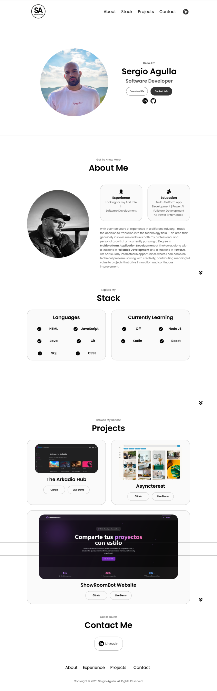

# 🌐 Sergio Agulla - Portfolio Website

This is my **personal portfolio website**, built with **HTML**, **CSS**, and **JavaScript**.  
It showcases my background, skills, and personal projects as a **Software Developer**.

---

## Live Preview

  

### Sections
- 🧠 **About Me** – Background, education, and professional goals.  
- 🧰 **Stack** – Technologies I master and the ones I’m currently learning.  
- 💼 **Projects** – Selected works with GitHub repositories and live demos.  
- 📬 **Contact** – Direct link to my LinkedIn profile.

---

## ⚙️ Tech Stack

  
  

---

##  Key Features

✅ Fully responsive layout  
✅ Minimalist and professional design  
✅ Smooth scrolling and UI animations  

---
